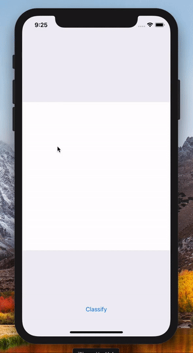

# SwiftDigits



## Training the model

Training the model by [scikit-learn](http://scikit-learn.org/) from Swift using [Swift for TensorFlow](https://medium.com/tensorflow/introducing-swift-for-tensorflow-b75722c58df0) which makes it possible to combine Swift with Python through `@dynamicMemberLookup` and `@dynamicCallable`.

```swift
import Python

let load_digits = Python.import("sklearn.datasets").load_digits
let LinearSVC = Python.import("sklearn.svm").LinearSVC
let train_test_split = Python.import("sklearn.model_selection").train_test_split

let classifier = LinearSVC()
let dataset = load_digits()
let (X_train, X_test, y_train, y_test)
    = train_test_split(dataset["data"], dataset["target"]).tuple4
classifier.fit(X_train, y_train)

print("train: \(classifier.score(X_train, y_train))")
print("test:  \(classifier.score(X_test, y_test))")
```

## Converting the model to Core ML

```swift
let coremltools = Python.import("coremltools")
let coreml_model = coremltools.converters.sklearn.convert(classifier)
coreml_model.save("Digits.mlmodel")
```

## Using the model from Core ML

```swift
let image = Image<UInt8>(uiImage: canvasView.image).resizedTo(width: 8, height: 8)
let input = try! MLMultiArray(shape: [8, 8], dataType: .double)

var pointer = input.dataPointer.bindMemory(to: Double.self, capacity: 8 * 8)
for pixel in image {
    pointer.pointee = Double(255 - pixel) / 16.0
    pointer += 1
}

let result = try! classifier.prediction(input: DigitsInput(input: input))
```

## How to build the app


1. `git submodule update --init --recursive`
2. Open [SwiftDigits.xcworkspace](SwiftDigits.xcworkspace) in Xcode and build it.

## License

MIT

